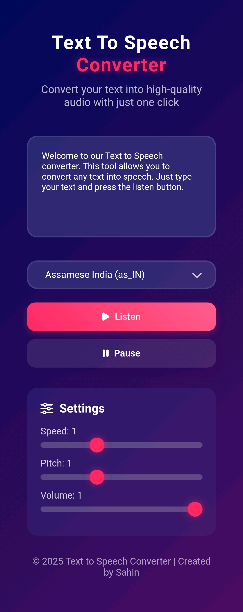

# Text-to-Voice Converter

A simple and intuitive text-to-speech converter built with modern web technologies. This application allows users to convert written text into natural-sounding speech with multiple voice options and customizable settings.

## ✨ Features

- **Text-to-Speech Conversion**: Convert any text input into high-quality speech
- **Multiple Voice Options**: Choose from various available voices and accents
- **Adjustable Speech Rate**: Control the speed of speech output
- **Volume Control**: Adjust playback volume to your preference
- **Pitch Adjustment**: Modify voice pitch for different tones
- **Pause/Resume**: Control playback with pause and resume functionality
- **Download Audio**: Save generated speech as audio files
- **Responsive Design**: Works seamlessly across desktop, tablet, and mobile devices
- **Clean UI**: Modern and user-friendly interface

## 🚀 Demo

[Live Demo](https://warm-sawine-7d5207.netlify.app/) - Try it out!

## 📸 Screenshots



## 🛠️ Technologies Used

- **HTML5**: Structure and semantic markup
- **CSS3**: Styling and responsive design
- **JavaScript**: Core functionality and Web Speech API integration
- **Web Speech API**: Browser-native text-to-speech capabilities

## 📋 Prerequisites

- Modern web browser with Web Speech API support (Chrome, Firefox, Safari, Edge)
- No additional installations required

## 🎯 Installation & Usage

### Option 1: Direct Use
1. Clone the repository:
   ```bash
   git clone https://github.com/SahinShazi/Text-to-Voice-Converter.git
   ```

2. Navigate to the project directory:
   ```bash
   cd Text-to-Voice-Converter
   ```

3. Open `index.html` in your web browser

### Option 2: Live Server (Recommended for development)
1. Install Live Server extension in VS Code
2. Right-click on `index.html` and select "Open with Live Server"

## 🔧 How to Use

1. **Enter Text**: Type or paste the text you want to convert to speech in the text area
2. **Select Voice**: Choose your preferred voice from the dropdown menu
3. **Adjust Settings**: 
   - Set speech rate (speed)
   - Adjust volume level
   - Modify pitch if desired
4. **Convert**: Click the "Speak" button to hear your text
5. **Control Playback**: Use pause, resume, and stop buttons as needed
6. **Download**: Save the generated audio file to your device

## 📁 Project Structure

```
Text-to-Voice-Converter/
│
├── index.html              # Main HTML file
├── css/
│   ├── style.css          # Main stylesheet
│   └── responsive.css     # Responsive design styles
├── js/
│   ├── main.js           # Core JavaScript functionality
│   └── voice-handler.js  # Voice processing logic
├── assets/
│   ├── images/           # UI images and icons
│   └── fonts/           # Custom fonts (if any)
├── README.md            # Project documentation
└── LICENSE              # License information
```

## 🌐 Browser Support

| Browser | Support |
|---------|---------|
| Chrome  | ✅ Full Support |
| Firefox | ✅ Full Support |
| Safari  | ✅ Full Support |
| Edge    | ✅ Full Support |
| Opera   | ✅ Full Support |

## 🤝 Contributing

Contributions are welcome! Here's how you can help:

1. **Fork** the repository
2. **Create** a feature branch:
   ```bash
   git checkout -b feature/amazing-feature
   ```
3. **Commit** your changes:
   ```bash
   git commit -m 'Add some amazing feature'
   ```
4. **Push** to the branch:
   ```bash
   git push origin feature/amazing-feature
   ```
5. **Open** a Pull Request

### Development Guidelines

- Follow consistent coding style
- Add comments for complex functionality
- Test across different browsers
- Ensure responsive design compatibility
- Update documentation for new features

## 🐛 Known Issues

- Some voices may not be available on all operating systems
- Speech rate limits may vary between browsers
- Large text blocks may have processing delays

## 📝 Future Enhancements

- [ ] SSML (Speech Synthesis Markup Language) support
- [ ] Custom voice training integration
- [ ] Batch text processing
- [ ] Advanced audio effects
- [ ] Multi-language support expansion
- [ ] Cloud-based voice options
- [ ] Audio waveform visualization

## 📜 License

This project is licensed under the MIT License - see the [LICENSE](LICENSE) file for details.

## 👨‍💻 Author

**Sahin Shazi**
- GitHub: [@SahinShazi](https://github.com/SahinShazi)
- Email: [your-email@example.com](mailto:your-email@example.com)

## 🙏 Acknowledgments

- Web Speech API documentation and community
- Open source contributors and testers
- Users providing feedback and suggestions

## 📞 Support

If you encounter any issues or have questions:

1. Check the [Issues](https://github.com/SahinShazi/Text-to-Voice-Converter/issues) page
2. Create a new issue with detailed description
3. Reach out via email for additional support

---

⭐ **Star this repository if you found it helpful!**


